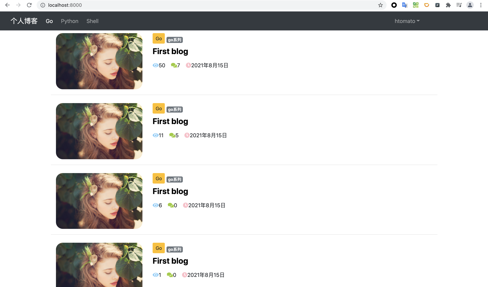

# Blog

使用 Python-Django 实现从 0 开发一个博客系统。

该博客主要包括以下几部分功能：

- 注册
- 登录
- 忘记密码
- 用户中心
- 写博客
- 博客首页
- 博客详情

首页展示：

Todo：

- 文档整理
- 容器化：备份成 Docker 镜像，上传到 Docker Hub
- CI/CD：使用 Travis CI/Github Action + systemd 自动化部署
- 添加中间件（Trace 等）

*更新于：2021年08月15日*

